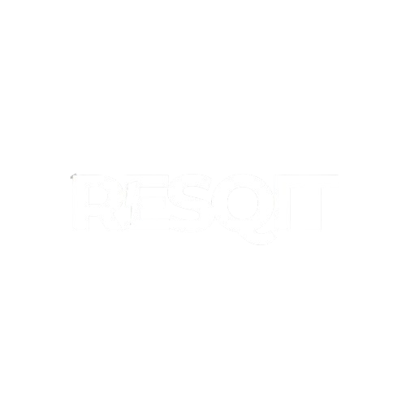
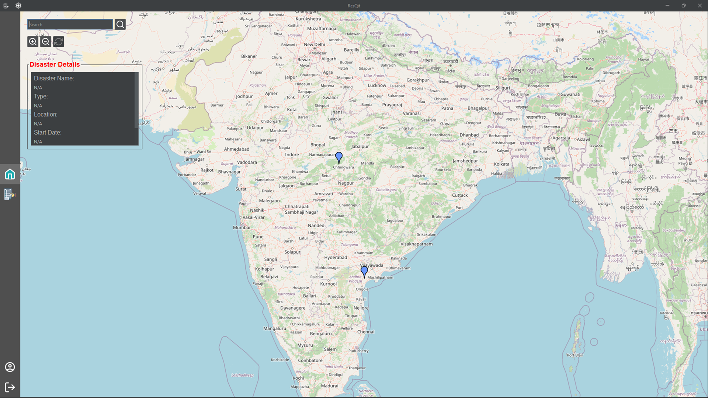
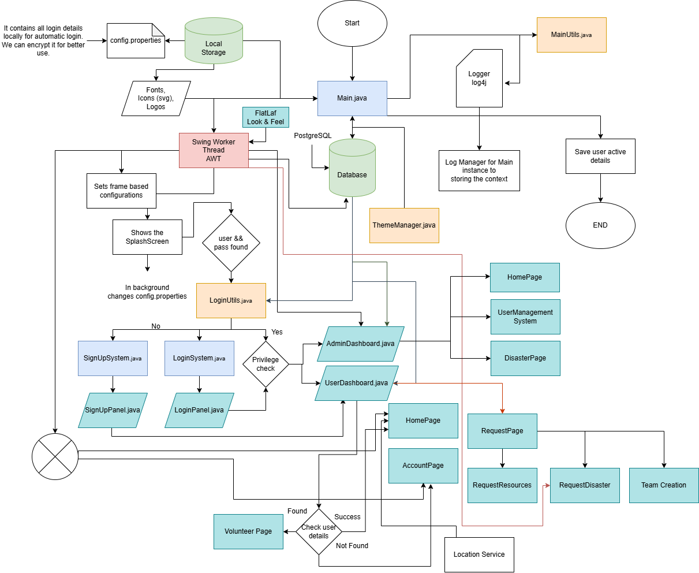

<div align="center">
  <a href="">
    
  </a>
  <h3>Disaster Response Coordination System</h3>
  <p style="max-width: 600px; text-align: center;">
    The <b>Disaster Response Coordination System</b> is a Java-based application designed to streamline disaster management by enhancing coordination between volunteers, administrators, and response teams. It enables efficient communication, resource allocation, and team management to ensure swift responses during emergencies.
  </p>
</div>
<hr>


## Features  
- **User Authentication** 🔑: Secure login and registration for users.  
- **Role-Based Access Control** 👥: Different roles for admins, co-admins, volunteers, and regular users.  
- **Volunteer Registration** 📝: A seamless onboarding process for disaster response volunteers.  
- **Disaster & Resource Requests** 🚑: Structured request submission for aid, resources, and support teams.  
- **Team Management** 🏥: Create and manage volunteer teams for disaster response efforts.  
- **Dynamic Theming** 🎨: Light and dark mode support for better user experience.  

## 📸 Screenshots  

For a detailed view of the application's user interface, check out **[screenshots.pdf](others/images/screenshots.pdf)**.  

## 🔧 Built With  
[![Java][Java]][Java-url] [![JavaFX][JavaFX]][JavaFX-url] [![Swing][Swing]][Swing-url] [![JDBC][JDBC]][JDBC-url] [![PostgreSQL][PostgreSQL]][PostgreSQL-url]  

## Getting Started  
### Prerequisites  
Before running the application, ensure you have the following installed:  
- **Java Development Kit (JDK 11 or higher)**  
- **PostgreSQL** (for database management)  

### Installation & Setup  
1. Clone this repository:  
   ```sh
   git clone https://github.com/Bookinheaven/ResQit.git
   cd disaster-response-system
   ```  
2. Set up your PostgreSQL database and update the database connection settings in the application.  
3. Compile and run the application:  
   ```sh
   javac -d bin src/main/java/org/burnknuckle/Main.java  
   java -cp bin Main
   ```  
4. Log in and explore the platform based on your assigned role.  

## Flowchart



## Roadmap 🛤️  
- [ ] Implement a **real-time notification system** for urgent disaster alerts.  
- [ ] Add a **geolocation-based incident tracking** feature.  
- [ ] Introduce **AI-driven resource allocation** for optimized disaster response.  

## Contributing 🤝  
Contributions are welcome! Feel free to submit pull requests, report issues, or suggest enhancements.  

## License 📜  
This project is open-source under the **MIT License**.  

---
[Java]: https://img.shields.io/badge/Java-007396?style=for-the-badge&logo=openjdk&logoColor=white  
[Java-url]: https://www.java.com  
[JavaFX]: https://img.shields.io/badge/JavaFX-FF7800?style=for-the-badge&logo=java&logoColor=white  
[JavaFX-url]: https://openjfx.io  
[Swing]: https://img.shields.io/badge/Swing-3A75C4?style=for-the-badge&logo=java&logoColor=white  
[Swing-url]: https://docs.oracle.com/javase/tutorial/uiswing/  
[JDBC]: https://img.shields.io/badge/JDBC-4479A1?style=for-the-badge&logo=database&logoColor=white  
[JDBC-url]: https://docs.oracle.com/javase/tutorial/jdbc/  
[PostgreSQL]: https://img.shields.io/badge/PostgreSQL-336791?style=for-the-badge&logo=postgresql&logoColor=white  
[PostgreSQL-url]: https://www.postgresql.org  
